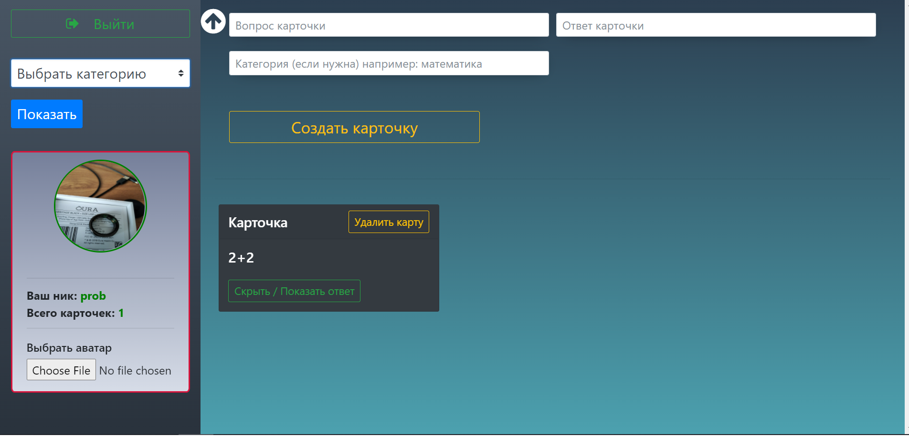
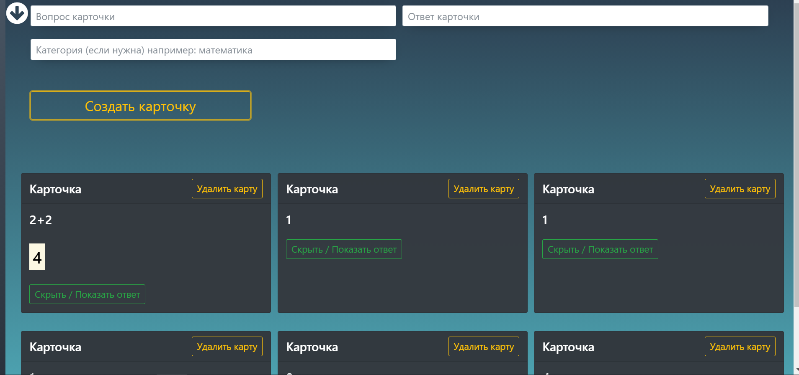

### Карточки для запоминания
> Наверняка многие слышали о "карточках памяти", именно их я и реализовал.
Пишите на одной стороне вопрос, на который вам нужно выучить ответ, а на другой стороне сам ответ.
Именно так это и реализовано
***
## Функционал:
- Добавление карточек
- Добавлять тип карточки(тема, к которой относится карточка, например, математика)
- Реализован удобный поиск по категориям карточек, чтобы вам не приходилось отдельно их искать
- Добавлен счетчик карточек
- Регистрация, авторизация, возможность поставить свой аватар :)
***
> Используйте на здоровье, но помните, что цифровое представление не заменит бумажное :)
***
## Build Setup
``` bash
# install dependencies
npm install

# serve with hot reload at localhost:8080
npm run dev
```
К сожалению, приложение имеет множество багов, да и код ужасен, все-таки я писал его в 2018 году.
Некоторые скриншоты приложения представлены ниже:





